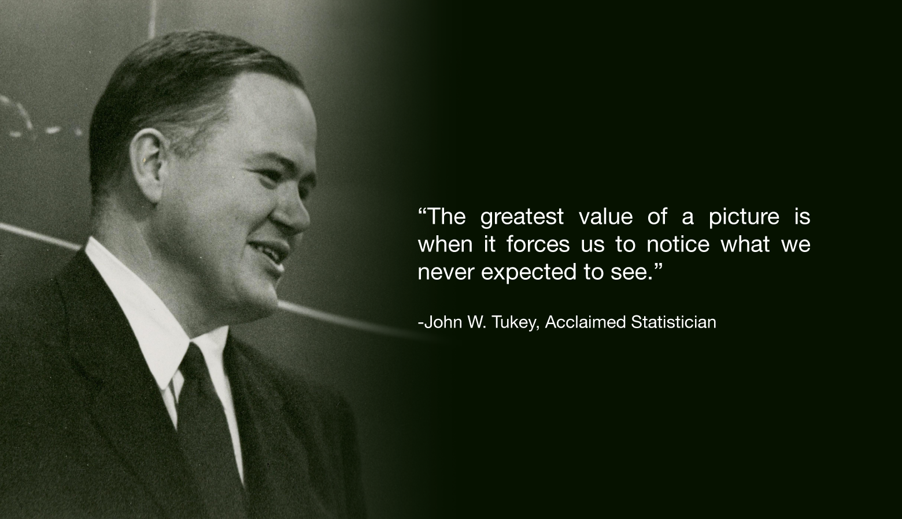

--- 
title: |
  {width=2in}   
  
  R ile Veri Görselleştirme
author: "Uğur Dar"
date: "17/12/2022"
site: bookdown::bookdown_site
documentclass: book
description: |
  Eskişehir R Users Group - ESTÜ Veri Bilimi Kulübü
---

# Veri Görselleştirme

Hazırlayan: **Uğur Dar**

İletişim: [LinkedIn](https://www.linkedin.com/in/ugurdar/) [Twitter](https://www.twitter.com/ugurdarr)

E-posta: ugurdar@eskisehir.edu.tr

## Neden gerekli?


<!-- “Basit bir grafik bir veri analistinin aklına herhangi başka bir araçtan daha fazla bilgi getirmiştir.”— John Tukey -->

```{r knitr-logo, out.width='100%', fig.show='hold',echo=FALSE}

```
 Kaynak: Princeton University

***"Bir resmin en büyük değeri, bizi görmeyi hiç beklemediğimiz bir şeyi fark etmeye zorlamasıdır." ***

<!-- [John Tukey](jtukey.png) -->


:::: {style="display: flex;justify-content: space-around;"}

::: {}

```{r echo=FALSE, message=FALSE, warning=FALSE}
library(ggplot2)
library(knitr)
library(dplyr)
x <- 1:100
y <- cumsum(rnorm(100))
data <- data.frame(x,y) 
data <- data %>% head()
kable(data)
```


:::

::: {}

```{r echo=FALSE, fig.height=3, fig.width=3}
ggplot(data, aes(x=x, y=y)) +
    geom_line()
```

:::

::::

## Veri görselleştirme adımları

1. Soruyu belirlenmesi.
2. Verinin elde edilmesi.
3. Verinin görselleştirmeye uygun hale getirilmesi.
4. Grafik tipinin belirlenmesi.
5. Görselleştirme aracına karar verilmesi.

## Dikkat edilmesi gerekenler

**1. Her bilgi görselleştirilmek zorunda değildir**

A birasını tercih edenlerin %40'ı erkektir bilgisinde görselleştirmeye değer bir bilgi bulunmamaktadır. Görselleştirme araçları çok sık kullanıldığında, hedef kitlenin odaklanması istenilen kısmı kaçırmasına neden olabilir.

**2. Grafiğin hedef kitlesinin belirlenmesi**

Görselleştirme, veriye göre çok karmaşık hale getirilebilir. Bazı durumlarda aynı grafik üzerinde çok fazla bilgi içermesi beklenebilir. Örneğin hisse senetlerini inceleyen bir yatırımcı aynı grafikte farklı metrik ve parametreleri görmek isteyebilir ya da telefon fiyatlarının zamana göre değişimini görmek isteyen başka birisi de daha basit bir grafik bekleyebilir.

**3. Doğru tipte grafikler kullanılması**

Çok farklı grafik tipleri mevcuttur. Veriyi en iyi özetleyen, verilmek istenen mesajı en iyi veren, amacına uygun grafik tipinin seçilmesi gerekir. 

**4. Yazı ve etiketler eklenmesi**

Okuyucu grafiğe baktığında özet bilgi kadar daha detaylı bilgi de bekleyebilir. Örneğin bir sütun grafiğinde sütunların üstüne, o sütunun değeri yazdırılabilir, aynı şekilde yüzde değerler de eklenebilir. Fazla bilgi verilmeye çalışılırken, grafiğin üzerinde anlaşılması güç, okunması güç yazılar eklenmemelidir.

Önemli noktalarda grafik üzerinde okuyucuya ekstra bilgi verilebilir.

**5. Renklerin belirlenmesi**

Veri görselleştirme araçlarının birçoğu varsayılan olarak farklı renkler, renk paletleri kullanmaktadır. Grafiği oluşturan kişi açısından renkli bir grafik daha hoş gözüküyor olabilir ancak bu okuyucuda aynı etkiyi bırakmayabilir. Herhangi bir değişkenlik olmadığında tek tip renk kullanılması daha uygundur.

**6. Eksen aralıklarının iyi belirlenmesi**


:::: {style="display: flex;justify-content: space-around;"}

::: {}

```{r echo=FALSE, fig.height=3, fig.width=3}
set.seed(1)
df <- data.frame(x=factor(LETTERS[1:2]), y=sample(1:100, 2))
ggplot(data=df, aes(x=x, y=y, width=.1)) + 
  geom_bar(stat="identity", position="identity") +
  labs(x="", y="")  +
  scale_y_continuous(limits = c(0,80))
```


:::

::: {}

```{r echo=FALSE, fig.height=3, fig.width=3}
ggplot(data=df, aes(x=x, y=y, width=.1)) + 
  geom_bar(stat="identity", position="identity") +
  labs(x="", y="")  +
  scale_y_continuous(limits = c(0,70))
```

:::

::::


**7. Grafiğin basit tutulması**

Grafikte gerekli olmayan bilgilerin çıkartılması, okuyucuyunun gerekli bilgilere daha kolay ulaşmasını sağlar. 
